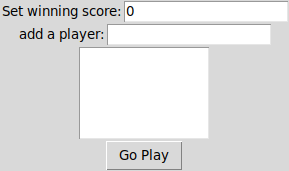
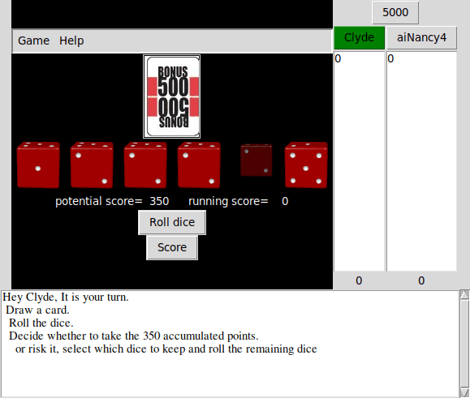
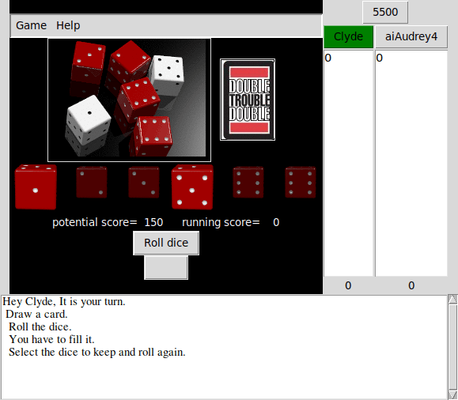

# FillRBust
FillRBust is a card and dice game I have enjoyed with real cards and dice.
As a silly exercize I captured the process of playing it in a Python script.
Initially it was just a text driven game, but the exercize grew into a project.
It has become version conrolled as of version 4, when I migrated from
Python2 to Python3. 

It was developed in a Linux environment. 
As a result, the mechanisms to 'install' it are negligible.

It is written in Python, specifically version 3.5.
It uses several modules:

- random
- collections
- copy
- tkinter
- tkinter.scrolledtext
- os
- sys
- getopt
- time
- datetime
- subprocess
- math
- PIL

It has options for using POVray to generate images of a set of dice,
and spd-say to translate text to speech.

## Running the code
From the command line, without any parameters, without a config file, ie
> <prompt\> ./fillrbust.py

Templates for run scripts are provided for Linux and Windows:

- goFillrbust
- goFillrbust.bat

An XFCE desktop shortcut file is provided as FillRBust.desktop.
The user must edit it to set the appropriate paths for the run script
and desktop icon.

When the script runs, the user will see a start-up screen

- Enter the 'Winning' score
- Enter the player name(s)
- - player names are accumulated in the pane until 'Go Play' is pressed
- - player names preceded with 'ai' will be played by the code
- - a single-digit number appended to an aiPlayer controls the risk the code takes when making decisions for the player
- Press 'Go Play'

The intital playing screen looks like this.

After turning over a card and rolling the dice, one would be presented with a screen like this.

Rules of the game and instructions on how to use the graphical user interface to play it are available from the 'Help' menu. 

## Speech and dice rendering options

`fillrbust.py` has a mechanism to render an image of the rolled dice using POVray.
The command line option, `-P`, will turn that on.
POVray is available for many platforms.
Installation is left to you the user.
When you have it installed, set the path to it in the method, seeTableDice.
This is an example screen with the rendered table of dice.

`fillrbust.py` has a mechanism to speak the commands to you using a text-to-speech engine if that software is on your computer.
The command line option, `-s`, will turn that on.
Typing 's' in the instruction pane will toggle that option as well.
Installation on your platform is left to you.
When it is installed, set the path to it in the method, talktome.
